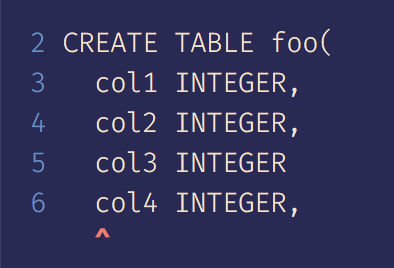
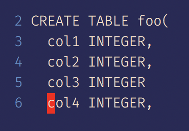

# pg-error-snippet

Show a code snippet for `node-postgres` errors.




### Installation

```
npm add --save pg-error-snippet
yarn add pg-error-snippet
```

### Usage

```js
const {Pool} = require('pg')
const {handleError} = require('pg-error-snippet')
const pool = new Pool(connectionOptions)

const query = 'CREATE TABLE foo()'

pool.query(query).catch((err) => {
  handleError(err, query, options)
})
```

### Options

| Option | Default | Description |
| :--- | :--- | :--- |
| eol | '\n' | You can use '\r\n' for CRLF line endings |
| linesBefore | 4 | The max number of lines to show before the error line
| linesAfter | 0 | The max number of lines to show after the error line
| label | 'postgres' | The label displayed before the error message
| errorStyle | 'arrow' | Options are 'arrow' or 'highlight' (see image above)
| showColors | true | Enable or disable colors
| errorColor | 'red' | Choose from one of the [colours](https://github.com/chalk/chalk#colors) available in chalk
| showLineNumbers | true | Enable or disable line numbers
| lineNumberColor | 'grey' | Choose from one of the [colours](https://github.com/chalk/chalk#colors) available in chalk
| showStack | true | Enable or disable logging the error stack

### API

#### handleError

```js
const {Pool} = require('pg')
const {handleError} = require('pg-error-snippet')
const pool = new Pool(connectionOptions)

performQuery('CREATE TABLE foo)')

// using try/catch
function performQuery(query) {
  try {
    return pool.query(query)
  } catch(error) {
    handleError(error, query, options)
  }
}

// using promises
function performQuery(query) {
  return pool.query(query).catch((error) => {
    handleError(error, query, options)
  })
}

```

#### createCodeSnippet

```js
const {Pool} = require('pg')
const {createCodeSnippetFromError} = require('pg-error-snippet')
const pool = new Pool(connectionOptions)

performQuery('CREATE TABL foo()')

function performQuery(query) {
  try {
    return pool.query(query)
  } catch(error) {
    if (error.position !== undefined) {
      const snippet = createCodeSnippetFromError(error, query, options)
      console.log(
        error.message + '\n'
        snippet + '\n',
        error.stack
      )
    }
  })
}
```
